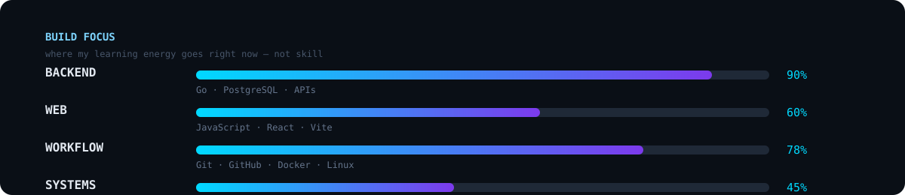

<div align="center">

```
laobare:~$git add new goals
laobare:~$git commit to them
laobare:~$git push toward becoming the best version of me
```
<br>

[](https://git.io/typing-svg)

<br>

[](https://github.com/LawObare)

</div>

---

# `LAW/OBARE`

> **Backend-minded developer. Curious about systems. Building toward full-stack.**

I'm **Lawrence Obare**, a software developer apprentice at **Zone01 Kisumu**.

I spend most of my time learning by building: writing Go programs, designing APIs, working with PostgreSQL, using Git and Docker, and gradually moving deeper into frontend development.

I'm especially interested in the part of software that is easy to hide behind abstractions:

**requests → logic → data → memory → systems → users**

I don't want to only know *what* makes software work.  
I want to understand **why it works**.

---

## `01 / NOW`

```text
╭──────────────────────────────────────────────────────────────╮
│ CURRENT BUILD                                                │
├──────────────────────────────────────────────────────────────┤
│                                                              │
│  PRIMARY        Go + Backend Development                     │
│  DATA           PostgreSQL                                   │
│  INTERFACES     REST APIs                                    │
│  WORKFLOW       Git + GitHub + Docker + Linux/WSL            │
│  FRONTEND       JavaScript + React + Vite                    │
│                                                              │
│  CURRENT MODE   BUILD > BREAK > DEBUG > UNDERSTAND           │
│                                                              │
╰──────────────────────────────────────────────────────────────╯
```

---

## `02 / THE TOOLBOX`

### Core

<p align="left">

</p>

### Web

<p align="left">

</p>

### What I'm actually working on

<p align="left">

</p>

> The bars aren't skill percentages. They're a snapshot of where my learning energy is going.

---

## `03 / THINGS I'VE BEEN BUILDING`

### `progress-bar`

A personal development and goal-tracking platform designed around the reality of developer training.

**Why:** I wanted a system that makes long-term development goals visible instead of leaving them in my head.

**Exploring:** React · Vite · frontend architecture · productivity workflows

---

### `pamoja-build`

A community-focused project exploring practical digital transactions using Bitcoin and the Lightning Network.

**Exploring:** backend systems · APIs · payments · community technology

---

### `small-business-analytics`

A project inspired by a real small-business problem: unpredictable customer traffic and the cost of preparing too much or too little.

**Exploring:** data collection · analytics · business insights · backend design

---

### `farmer-information-platform`

A project concept around delivering useful agricultural information to farmers through APIs, location data and messaging.

**Exploring:** APIs · geolocation · SMS · real-world applications

---

## `04 / MY LEARNING LOOP`

```text
             ┌──────────────┐
             │    LEARN     │
             └──────┬───────┘
                    ↓
             ┌──────────────┐
             │    BUILD     │
             └──────┬───────┘
                    ↓
             ┌──────────────┐
             │    BREAK     │
             └──────┬───────┘
                    ↓
             ┌──────────────┐
             │    DEBUG     │
             └──────┬───────┘
                    ↓
             ┌──────────────┐
             │  UNDERSTAND  │
             └──────┬───────┘
                    ↓
             ┌──────────────┐
             │   REBUILD    │
             └──────┬───────┘
                    │
                    └──────────────→ repeat
```

Right now, that loop is taking me deeper into:

- Go fundamentals
- pointers, structs and memory
- HTTP and API design
- PostgreSQL and database design
- backend architecture
- Git and collaborative workflows
- Docker and development environments
- JavaScript and React

---

## `05 / GITHUB TELEMETRY`

<div align="center">

[](https://github.com/LawObare)

</div>

<div align="center">


</div>

<div align="center">

[](https://git.io/streak-stats)

</div>

---

## `06 / CONTRIBUTION ARCADE`

<div align="center">

<picture>
  <source media="(prefers-color-scheme: dark)" srcset="https://raw.githubusercontent.com/LawObare/LawObare/output/snake-dark.svg">
  
</picture>

</div>

---

## `07 / 3D ACTIVITY`

<div align="center">


</div>

---

## `08 / OPEN SOURCE`

```text
┌────────────────────────────────────────────────────────────┐
│                                                            │
│  I want my GitHub to show more than tutorial exercises.   │
│                                                            │
│  → Build useful projects                                  │
│  → Contribute to open source                               │
│  → Learn from other people's code                          │
│  → Document what I discover                                │
│  → Keep shipping                                           │
│                                                            │
└────────────────────────────────────────────────────────────┘
```

---

## `09 / OUTSIDE THE CODE`

I'm interested in technology that connects software to **real people and real problems**.

That is why many of the things I build start from questions like:

- Can software help a small business make better decisions?
- Can developers manage their learning more intentionally?
- Can APIs make useful information easier to reach?
- Can technology solve a local problem without becoming unnecessarily complicated?

---

## `10 / FIND ME`

<div align="center">

<a href="https://github.com/LawObare">

</a>
<a href="https://www.linkedin.com/in/lawrence-obare-bb0390425/">

</a>
<a href="https://dev.to/obare">

</a>
<a href="mailto:obarelawrence.acc@gmail.com">

</a>

</div>

---

<div align="center">

```text
╭──────────────────────────────────────────────╮
│                                              │
│   LAW/OBARE                                  │
│   BUILDING IN PUBLIC                         │
│                                              │
│   backend → full-stack → systems             │
│                                              │
╰──────────────────────────────────────────────╯
```

**If something here interests you, let's build something.**

</div>
